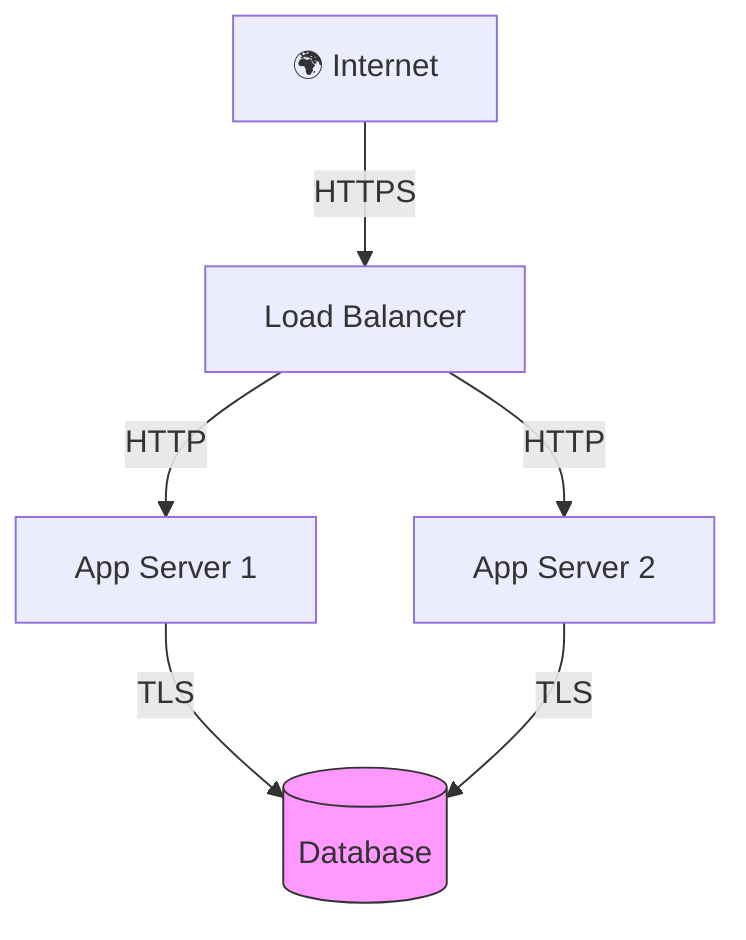

---
name: diagram-infra
description: "Infrastructure diagrams: cloud, network, security, AWS, Azure. Use when user mentions 'cloud', 'AWS', 'Azure', 'réseau', 'sécurité'."
---
|

# diagram-infra
|
# Diagram Infra

## Domaine et périmètre

Ce skill génère des **diagrammes d'infrastructure** :
- Diagrammes cloud (AWS, Azure, GCP) avec icônes de service
- Topologies réseau (LAN, WAN, VPN, pare-feu)
- Architecture de sécurité (zones, DMZ, chiffrement)
- Infrastructure locale (Z600, VM1, LXC, réseau physique)

## Méthodologie

### Phase 1 : Identification des composants
- Lister les composants infrastructure (serveurs, réseaux, services).
- Identifier les flux de données entre composants.
- Déterminer les zones de sécurité (public, privé, DMZ).

### Phase 2 : Générer le diagramme
- Utiliser Mermaid (graph TB/LR) ou PlantUML (component diagram).
- Placer les composants selon la topologie.
- Ajouter les flux et les annotations de sécurité.

### Phase 3 : Livraison
- Intégrer le diagramme dans la réponse.
- Expliquer les choix d'architecture.
- Documenter les risques identifiés.

## Règles de décision
- **Règle 1** : Mermaid pour les flux simples, PlantUML pour les architectures complexes.
- **Règle 2** : Toujours marquer les zones de sécurité (public/privé/DMZ).
- **Règle 3** : Les flux chiffrés sont en vert, les flux en clair en rouge.

## Format de sortie

## Exemples d'utilisation
- "Dessine l'architecture réseau de gerivdb" → Diagramme Mermaid.
- "Montre l'infrastructure Z600 + VM1" → Schéma local.
- "Sécurise le flux entre gateway et BDCP" → Annotations sécurité.

## Intégration avec l'écosystème
- Dépôts concernés : ECOS-VISION, documentation infrastructure
- Couche EECS : L2_COMPOSITION
- Tags NEXUS : [CONFORME_NEXUS]

