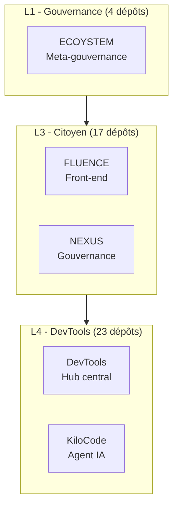

|
# ECOS Vision

## Domaine et périmètre

Ce skill couvre la **visualisation cross-repo** de l'écosystème gerivdb :
- ECOS-VISION (dépôt de visualisation de l'écosystème)
- Diagrammes des couches EECS (L0 à L4.5)
- Vue d'ensemble des 46+ dépôts gerivdb
- Cartographie des dépendances inter-dépôts

## Méthodologie

### Phase 1 : Collecte de l'état actuel
- Lire ECOS_ROOT.json pour la liste des dépôts.
- Récupérer les métadonnées (description, dernier commit, langage).
- Organiser par couche EECS (L0 à L4.5).

### Phase 2 : Génération de la vue
- Produire un diagramme Mermaid ou PlantUML montrant les couches.
- Annoter les dépendances critiques (flèches rouges).
- Générer les statistiques (nombre de dépôts par couche, activité).

### Phase 3 : Livraison
- Intégrer le diagramme dans la réponse.
- Proposer des vues alternatives (par couche, par langage, par activité).
- Mettre à jour ECOS-VISION si nécessaire.

## Règles de décision
- **Règle 1** : La vue doit être lisible dans un chat (pas de diagramme trop large).
- **Règle 2** : Les couches EECS sont : L0 (physique), L1 (causalité), L2 (composition), L3 (émergence), L4 (orchestration), L5 (méta).
- **Règle 3** : Les dépôts inactifs (> 90 jours) sont regroupés à part.

## Format de sortie

## Exemples d'utilisation
- "Affiche la vue d'ensemble de l'écosystème" → Diagramme Mermaid.
- "Montre les dépendances de FLUENCE" → Sous-graphe.
- "Quels sont les dépôts L4 ?" → Lister.
- "Cartographie les changements du mois" → Diff visuel.

## Intégration avec l'écosystème
- Dépôts concernés : ECOS-VISION, NEXUS, ECOS_ROOT
- Couche EECS : L2_COMPOSITION
- Tags NEXUS : [CONFORME_NEXUS]
