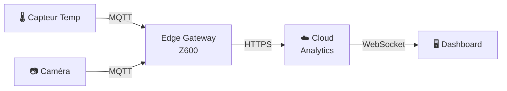

|
# IoT Diagram

## Domaine et périmètre

Ce skill génère des **diagrammes d'architecture IoT** :
- Architectures capteurs → edge → cloud
- Protocoles IoT (MQTT, CoAP, AMQP, HTTP)
- Edge computing (traitement local, gateway)
- Intégration avec l'infrastructure Z600 (edge node)

## Méthodologie

### Phase 1 : Identification de l'architecture
- Lister les composants IoT (capteurs, actionneurs, gateways, cloud).
- Identifier les protocoles de communication.
- Déterminer les flux de données (collecte → traitement → stockage).

### Phase 2 : Générer le diagramme
- Utiliser Mermaid (graph LR) pour les flux.
- Placer les composants : capteurs → edge → cloud.
- Annoter les protocoles sur les flux.

### Phase 3 : Livraison
- Intégrer le diagramme dans la réponse.
- Expliquer les choix d'architecture.
- Documenter les contraintes (latence, bande passante, sécurité).

## Règles de décision
- **Règle 1** : MQTT pour les capteurs légers, HTTP pour les payloads lourds.
- **Règle 2** : Le edge computing est obligatoire si latence < 100ms requise.
- **Règle 3** : Les flux chiffrés (TLS) sont en vert, les flux en clair en rouge.

## Format de sortie

## Exemples d'utilisation
- "Dessine l'architecture IoT de gerivdb" → Diagramme Mermaid.
- "Comment intégrer un capteur sur le Z600 ?" → Architecture edge.
- "Compare MQTT vs CoAP pour les capteurs" → Tableau comparatif.

## Intégration avec l'écosystème
- Dépôts concernés : ECOS-VISION, Z600, documentation
- Couche EECS : L2_COMPOSITION
- Tags NEXUS : [CONFORME_NEXUS]
