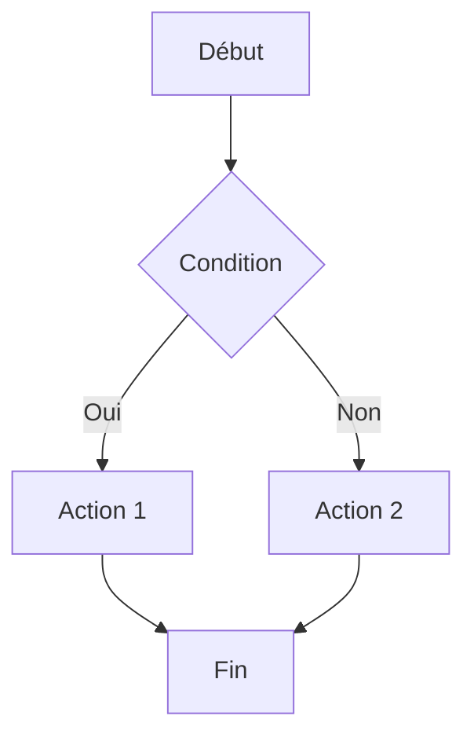

# Diagram Mermaid

## Domaine et périmètre

Ce skill génère des **diagrammes Mermaid** :
- Flowcharts (diagrammes de flux)
- Gantt charts (planning de projet)
- ERD (Entity Relationship Diagrams)
- Git graphs (historique de branches)
- Sequence diagrams (interactions entre composants)

## Méthodologie

### Phase 1 : Choix du type de diagramme
- Flux de processus → Flowchart
- Planning → Gantt
- Données/relations → ERD
- Historique Git → Gitgraph
- Interactions → Sequence diagram

### Phase 2 : Écritre la syntaxe Mermaid
- Définir les nœuds, les arêtes, les labels.
- Appliquer les styles (couleurs, formes).
- Tester le rendu (Mermaid live editor ou prévisualisation Markdown).

### Phase 3 : Livraison
- Encadrer dans un code fence `mermaid`.
- Expliquer les choix de modélisation.
- Proposer des variantes si pertinent.

## Règles de décision
- **Règle 1** : Toujours utiliser `graph TB` (top-bottom) par défaut.
- **Règle 2** : Les labels doivent être courts et lisibles.
- **Règle 3** : Limiter à 15 nœuds par diagramme (au-delà, scinder).

## Format de sortie

## Exemples d'utilisation
- "Crée un flowchart du pipeline SCAFFOLD" → Flowchart Mermaid.
- "Dessine l'ERD de ECOS_ROOT" → Entity Relationship.
- "Montre les branches Git de NEXUS" → Gitgraph.
- "Gantt du projet PLIX" → Gantt chart.

## Intégration avec l'écosystème
- Dépôts concernés : ECOS-VISION, documentation
- Couche EECS : L2_COMPOSITION
- Tags NEXUS : [CONFORME_NEXUS]
