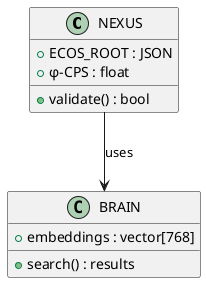

# Diagram UML

## Domaine et périmètre

Ce skill génère des **diagrammes UML** via PlantUML :
- Diagrammes de classes (structure logicielle)
- Diagrammes de séquence (interactions temporelles)
- Diagrammes d'activité (workflow métier)
- Diagrammes de déploiement (architecture physique)
- ArchiMate (architecture d'entreprise)
- BPMN (processus métier)

## Méthodologie

### Phase 1 : Choix du type UML
- Structure statique → Diagramme de classes
- Interactions → Diagramme de séquence
- Workflow → Diagramme d'activité ou BPMN
- Infrastructure → Diagramme de déploiement
- Architecture entreprise → ArchiMate

### Phase 2 : Écriture PlantUML
- Commencer par `@startuml` / `@enduml`.
- Définir les éléments (classes, acteurs, processus).
- Ajouter les relations (héritage, association, dépendance).
- Appliquer les stéréotypes et annotations.

### Phase 3 : Livraison
- Encadrer dans un code fence `plantuml`.
- Expliquer la structure et les choix de modélisation.
- Proposer des simplifications si le diagramme est trop dense.

## Règles de décision
- **Règle 1** : Classes = boîtes avec attributs + méthodes.
- **Règle 2** : Éviter plus de 10 classes par diagramme (scinder sinon).
- **Règle 3** : Les stéréotypes UML (`<<interface>>`, `<<abstract>>`) sont obligatoires.

## Format de sortie

## Exemples d'utilisation
- "Diagramme de classes pour FLUENCE" → PlantUML class diagram.
- "Séquence de la Triade IRIS→KRONOS→FLUX" → Sequence diagram.
- "BPMN du workflow SCAFFOLD" → BPMN.
- "ArchiMate de l'écosystème L1-L5" → ArchiMate.

## Intégration avec l'écosystème
- Dépôts concernés : ECOS-VISION, NEXUS, documentation
- Couche EECS : L2_COMPOSITION
- Tags NEXUS : [CONFORME_NEXUS]
